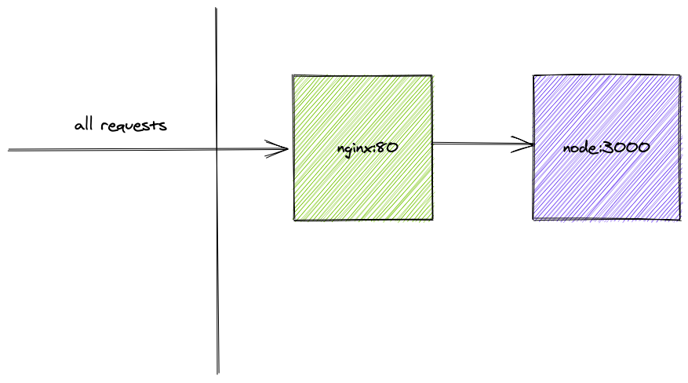

Docker is amazing. It is the gateway for all amazing things you can do in devops. Once you get the hang of it, you can never go back.

It gives you deterministic builds every single time. Guaranteed! No more of _these_ replies to your Manager :P

> it worked on my machine, really.

# but what is Docker?

Docker is a way to package your app and run it. With _Docker_

- you can define and fix the execution environment of your app
- and totally decouple the app from the host machine

For example say you are working on the latest and greatest app of the year on a mac but your production servers run linux. Such a bummer. You can't say if everything will run as-is on prod cuz you won't know! Anything can go wrong. The dependencies of the app might depend on native libraries, or the os might use _forward slash_ or _backlash_ for paths(windows). So you get the drift; why we need determinism inspite of all the different host/os/environments/ configurations.

# where do I start?

Everything starts with a Dockerfile. To start on a more practical note, I'll try to package/dockerise a React Node app but here _react_ doesn't matter and it could be anything {insert-your-fav-framework-please}

So I've just bootstrapped a react app using _create react app_ ([github snapshot](https://github.com/ankeetmaini/docker-react-nginx/tree/6a5d4e77d777fc23d2a772b23fcf56a85068c410)).

**First question** that needs to be answered before ~~copy-pasting~~ writing a `Dockerfile` is what is the os/flavour of your production environment (usually it's linux) and what're your dependencies?

Since I'm running a node app, I'd want atleast `node` installed on the linux machine.

> Base image: is the thing that helps you define environment and any dependencies your app wants.

The base images for most _(if not all)_ languages/engines/runtimes already exist on [Docker Hub](https://hub.docker.com) by the official authors/companies/orgs.

Like the official [Node image here](https://hub.docker.com/_/node). You can choose from a variety of versions and flavours. I chose [Node v12 installed on a trimmed Debian OS](https://github.com/nodejs/docker-node/blob/9518f46153d0ab2a3ebb20bc24c28ee0c48af208/12/stretch-slim/Dockerfile)

This would be the very first line of the Dockerfile.

```dockerfile
FROM node:12-stretch-slim
```

> _layering_ in docker: every line in the Dockerfile becomes a `layer` which translates to an intermediate image. A docker image is made up of a number of these intermediate image layers.

The image layers are cached by docker and they could speed up the entire building process if the cache is not busted. This is the reason why one must be extra careful in writing the Dockerfile.

Always try to see if the top lines/layers are not changed, as every layer from then on will be discarded and built again.

> _multi-stage_ docker builds is one more concept that needs to be discussed before we delve into the art of writing the ultimate Dockerfile

Docker **image size** is of great importance and one should strive to get to the slimmest image possible. It directly improves the time it takes to deploy, saves a lot of storage for you and not to forget the security aspect where the lesser the surface area of your image the less chances of someone finding loopholes in it. And why have something in your prod image that you aren't even using?

_Multi stage_ docker helps in trimming the size of the docker image by giving you the option of removing extra layers in your image and keep only the stuff required. In absence of multi stage docker builds people used multiple Dockerfiles to achieve the same results. You can have one single Dockerfile for both prod and dev.

`Multi stage` lets you have multiple `FROM` statements and ability to copy stuff from one stage to another.

> boundary of a stage extends from the start of a `FROM` statement till another `FROM` statement or till the end of the file

This way you can define different stages for

- static analysis like lint checks
- tests
- build
- final where you just copy the built assets


## writing the Dockerfile

Switching the focus back to Dockerfile which only has one line specifying the base image. The next thing to do is to define the _working directory_ using the `WORKDIR` command. It creates a directory if it does not exist. It also sets the context of all commands run subsequently with the given directory as the base path.

Also, notice the `as` keyword which is the syntax to name a multi stage build step. This step can now be referenced as `test` from another stage.

```dockerfile
FROM node:12-stretch-slim as test

WORKDIR /docker-react-nginx
```

If you're to peek inside the os right now you'd see

```bash
root@726b2a193270:/# ls -al
total 76
drwxr-xr-x   1 root root 4096 Jun 20 11:21 .
drwxr-xr-x   1 root root 4096 Jun 20 11:21 ..
-rwxr-xr-x   1 root root    0 Jun 20 11:21 .dockerenv
drwxr-xr-x   2 root root 4096 Apr 22 00:00 bin
drwxr-xr-x   2 root root 4096 Feb  1 17:09 boot
drwxr-xr-x   5 root root  360 Jun 20 11:22 dev
drwxr-xr-x  19 root root  608 Jun 18 12:02 docker-react-nginx
drwxr-xr-x   1 root root 4096 Jun 20 11:21 etc
drwxr-xr-x   1 root root 4096 Apr 23 03:09 home
drwxr-xr-x   1 root root 4096 Apr 22 00:00 lib
drwxr-xr-x   2 root root 4096 Apr 22 00:00 lib64
drwxr-xr-x   2 root root 4096 Apr 22 00:00 media
drwxr-xr-x   2 root root 4096 Apr 22 00:00 mnt
drwxr-xr-x   1 root root 4096 Apr 29 02:26 opt
dr-xr-xr-x 174 root root    0 Jun 20 11:21 proc
drwx------   1 root root 4096 Apr 29 02:26 root
drwxr-xr-x   3 root root 4096 Apr 22 00:00 run
drwxr-xr-x   2 root root 4096 Apr 22 00:00 sbin
drwxr-xr-x   2 root root 4096 Apr 22 00:00 srv
dr-xr-xr-x  12 root root    0 Jun 20 11:21 sys
drwxrwxrwt   1 root root 4096 Apr 29 02:26 tmp
drwxr-xr-x   1 root root 4096 Apr 22 00:00 usr
drwxr-xr-x   1 root root 4096 Apr 22 00:00 var
```

You can see a folder `docker-react-nginx` (6th item from the top) created automatically inside what looks like a linux operating system. Fantastic!

## installing dependencies

> Of all the things in frontend development the most frustrating would definitely be `(npm|yarn) install`

If you remember the layering concept I mentioned above can be utilized to optimize this and do this only if dependencies **really** change.

```dockerfile
COPY  package.json yarn.*lock ./
RUN yarn install --pure-lockfile
```

The `package.json` is first copied before installing the dependencies as the docker image is empty and anything you want there has to be copied from host machine or created there.

> Why not copy all the source files and with it `package.json` as well? This could prove detrimental to the time it takes to build the image. Even for commits that don't change the deps the `npm i` would not be cached and would get executed every time.

Doing it separately caches it and Docker runs it only if the checksum of `package.json` or lock file changes. Also note the flag `--pure-lockfile` which will respect the pinned versions and not take the latest semver matching package as per `~|^` in the package.json

## copy the source files

```dockerfile
COPY  . .
```

## run tests, lints etc

```dockerfile
RUN yarn test
```

I only ran unit tests but you can run all sorts of checks which you'd run on a PR like prettier checks, lint checks, ts checks etc.

## building assets

While building assets it's essential certain environment variables are set correctly, e.g. `NODE_ENV=production`. These and others on which your app depends can be set easily using `ENV` directive.

> ENV vs ARG

There are two types of parameters you can use in the whole docker lifecycle. `ENV` can be defined inside the Dockerfile and also passed in while running the docker image, on the other hand `ARG` can be defined in Dockerfile and passed in only at the time of building the image and can no longer be accessed when you run the built docker image.

```dockerfile
ENV NODE_ENV production
# build client JS and server
RUN yarn build
RUN yarn build:server
```

## final stage (well not quite)

At this stage the image is almost ready and can be run as-is. _But, we can do better._

There's a lot of stuff here which can be removed like _node modules_, _source files_, _intermediate image layers_. Let's remove them by taking only the stuff that is needed in a new multi-stage build step.

```dockerfile
# starting from a clean state
FROM node:12-stretch-slim
WORKDIR /docker-react-nginx

COPY --from=test /docker-react-nginx/build .
CMD ["node", "server.js"]
```

If you notice I ran the `server.js` directly using `node`. No node process managers like `PM2` or `forever`. These process managers are used generally because node is single threaded and to have HA (redundancy), parallelism and making sure one process is always up. Even if a process goes down these process managers spawn a new one. But this is not needed in container world. You can get the same redundancy by spinning multiple docker containers using some federation software be it docker swarm, kubernetes etc. (I may do a separate blog post on it in future)

The Dockerfile at this point works.

```dockerfile
FROM node:12-stretch-slim as test

WORKDIR /docker-react-nginx

COPY  package.json yarn.*lock ./
RUN yarn install --pure-lockfile

COPY  . .
# env CI as I'm using create react app
# and it runs the tests in watch mode
# untill you make this env true
ENV CI true
RUN yarn test

ENV NODE_ENV production
# build client JS and server
RUN yarn build
RUN yarn build:server

FROM node:12-stretch-slim
WORKDIR /docker-react-nginx

COPY --from=test /docker-react-nginx/build .
CMD ["node", "server.js"]

```

But there's a lot more that can be done to take it to the next level.

# improvements

## least privilege user

All the commands now are run with `root` user context. Although `root` inside docker container is not the same as `root` in host machine. But the privilege must be limited and should only be just enough to do the task. This is pretty easy to achieve as `node` docker images ship with a user `NODE` which is a non-root user.

Changing the Dockerfile to use this user instead of root. This needs to be changed at a couple of places.

- first when doing the `WORKDIR` as docker creates the directory using root permissions, but if the directory is already created docker would just `cd` instead of `mkdir` + `cd`
- adding `USER` directive to enable the specific user's context for all subsequent `CMD`, `RUN` and `ENTRYPOINT` instructions

```diff
+ RUN mkdir -p /docker-react-nginx && chown -R node:node /docker-react-nginx
+ USER node

WORKDIR /docker-react-nginx
```

- use `NODE` user for copying files from host machine

```diff
# node_modules install
- COPY  package.json yarn.*lock ./
+ COPY  --chown=node:node package.json yarn.*lock ./

# source copy step
- COPY  . .
+ COPY --chown=node:node  . .
```

## dry out base image in FROM statements

- in both of the multi stage builds the `FROM` statements starts and defines the base image as `node:12-stretch-slim`, such repetition :/
- this can be DRYed out using another empty stage at the top

```diff
+ FROM node:12-stretch-slim as base

# test stage
- FROM node:12-stretch-slim as test
+ FROM base as test

# final stage
- FROM node:12-stretch-slim
+ FROM base
```

# improved Dockerfile

```dockerfile
FROM node:12-stretch-slim as base

FROM base as test

# least privilege user
RUN mkdir -p /docker-react-nginx && chown -R node:node /docker-react-nginx
USER node

WORKDIR /docker-react-nginx

# node module deps as a separate layer for caching
COPY  --chown=node:node package.json yarn.*lock ./
RUN yarn install --pure-lockfile

# copy source code
COPY --chown=node:node  . .

# run any tests you want to, linting, prettier, unit etc
ENV CI true
RUN yarn test

ENV NODE_ENV production
# after successful test build your JS assets etc
RUN yarn build
RUN yarn build:server

FROM base as prod
# least privilege user
RUN mkdir -p /docker-react-nginx && chown -R node:node /docker-react-nginx
USER node

WORKDIR /docker-react-nginx

# only copy needed assets, node_modules
# etc will be left in test image, super light prod image
COPY --chown=node:node --from=test /docker-react-nginx/build .
CMD ["node", "server.js"]
```

# building the image

To build the image from the above Dockerfile do from the root of the app `docker build . -t docker-react` (output pasted below)

```bash
$ docker build . -t docker-react
Sending build context to Docker daemon  1.333MB
Step 1/19 : FROM node:12-stretch-slim as base
 ---> 5f9b3855deed
Step 2/19 : FROM base as test
 ---> 5f9b3855deed
Step 3/19 : RUN mkdir -p /docker-react-nginx && chown -R node:node /docker-react-nginx
 ---> Running in cfca6e721a4e
Removing intermediate container cfca6e721a4e
 ---> 40af99c028bd
Step 4/19 : USER node
 ---> Running in 66ee62ba1823
Removing intermediate container 66ee62ba1823
 ---> 6bfe6580eb2f
Step 5/19 : WORKDIR /docker-react-nginx
 ---> Running in 83de3f61b3cb
Removing intermediate container 83de3f61b3cb
 ---> 4c42bb1ab0ee
Step 6/19 : COPY  --chown=node:node package.json yarn.*lock ./
 ---> 4d55dbfb8eee
Step 7/19 : RUN yarn install --pure-lockfile
 ---> Running in c3b31b0a4002
yarn install v1.22.4
[1/4] Resolving packages...
[2/4] Fetching packages...
info fsevents@2.1.2: The platform "linux" is incompatible with this module.
info "fsevents@2.1.2" is an optional dependency and failed compatibility check. Excluding it from installation.
info fsevents@1.2.12: The platform "linux" is incompatible with this module.
info "fsevents@1.2.12" is an optional dependency and failed compatibility check. Excluding it from installation.
info fsevents@2.1.3: The platform "linux" is incompatible with this module.
info "fsevents@2.1.3" is an optional dependency and failed compatibility check. Excluding it from installation.
[3/4] Linking dependencies...
warning " > @testing-library/user-event@7.2.1" has unmet peer dependency "@testing-library/dom@>=5".
warning "react-scripts > @typescript-eslint/eslint-plugin > tsutils@3.17.1" has unmet peer dependency "typescript@>=2.8.0 || >= 3.2.0-dev || >= 3.3.0-dev || >= 3.4.0-dev || >= 3.5.0-dev || >= 3.6.0-dev || >= 3.6.0-beta || >= 3.7.0-dev || >= 3.7.0-beta".
[4/4] Building fresh packages...
Done in 78.54s.
Removing intermediate container c3b31b0a4002
 ---> 2f0cbc6bc005
Step 8/19 : COPY --chown=node:node  . .
 ---> 92b4fd2b4096
Step 9/19 : ENV CI true
 ---> Running in 23675ee3e798
Removing intermediate container 23675ee3e798
 ---> dd2d584fe708
Step 10/19 : RUN yarn test
 ---> Running in c959170b3c42
yarn run v1.22.4
$ react-scripts test
PASS src/App.test.js
  ✓ renders learn react link (75ms)

Test Suites: 1 passed, 1 total
Tests:       1 passed, 1 total
Snapshots:   0 total
Time:        3.08s
Ran all test suites.
Done in 4.47s.
Removing intermediate container c959170b3c42
 ---> 12f9a44ad631
Step 11/19 : ENV NODE_ENV production
 ---> Running in 8565262aacd5
Removing intermediate container 8565262aacd5
 ---> cf84074c7fcc
Step 12/19 : RUN yarn build
 ---> Running in 1011233a4614
yarn run v1.22.4
$ react-scripts build
Creating an optimized production build...
Compiled successfully.

File sizes after gzip:

  39.39 KB  build/static/js/2.6da29292.chunk.js
  781 B     build/static/js/runtime-main.b96d1615.js
  654 B     build/static/js/main.cdcd3796.chunk.js
  556 B     build/static/css/main.d1b05096.chunk.css

The project was built assuming it is hosted at /.
You can control this with the homepage field in your package.json.

The build folder is ready to be deployed.
You may serve it with a static server:

  yarn global add serve
  serve -s build

Find out more about deployment here:

  bit.ly/CRA-deploy

Done in 11.42s.
Removing intermediate container 1011233a4614
 ---> f7f716b03cc9
Step 13/19 : RUN yarn build:server
 ---> Running in 807ba45624b4
yarn run v1.22.4
$ parcel build ./server.js -d build --target node --bundle-node-modules
✨  Built in 8.05s.

build/server.js.map    ⚠️  1.17 MB    166ms
build/server.js         561.59 KB    7.37s
Done in 9.30s.
Removing intermediate container 807ba45624b4
 ---> 7ec2bcaa380b
Step 14/19 : FROM base as prod
 ---> 5f9b3855deed
Step 15/19 : RUN mkdir -p /docker-react-nginx && chown -R node:node /docker-react-nginx
 ---> Using cache
 ---> 40af99c028bd
Step 16/19 : USER node
 ---> Using cache
 ---> 6bfe6580eb2f
Step 17/19 : WORKDIR /docker-react-nginx
 ---> Using cache
 ---> 4c42bb1ab0ee
Step 18/19 : COPY --chown=node:node --from=test /docker-react-nginx/build .
 ---> 249865c763d2
Step 19/19 : CMD ["node", "server.js"]
 ---> Running in 191238cf82cc
Removing intermediate container 191238cf82cc
 ---> 13999baf2bca
Successfully built 13999baf2bca
Successfully tagged docker-react:latest
```

You can validate the layering concept here as each line is converted into a step and is cached in an intermediate container image.

Let's take a look at the size of the image

```bash
$ docker image ls | grep docker-react
docker-react  latest  13999baf2bca  22 seconds ago  142MB
```

**142 MB** is the total size of the image on disk. I wonder what's taking this space, is it my code? Examining it using `docker history <image-tag>`

```bash
$ docker history docker-react
IMAGE               CREATED             CREATED BY                                      SIZE                COMMENT
13999baf2bca        6 minutes ago       /bin/sh -c #(nop)  CMD ["node" "server.js"]     0B
249865c763d2        6 minutes ago       /bin/sh -c #(nop) COPY --chown=node:nodedir:…   2.29MB
4c42bb1ab0ee        8 minutes ago       /bin/sh -c #(nop) WORKDIR /docker-react-nginx   0B
6bfe6580eb2f        8 minutes ago       /bin/sh -c #(nop)  USER node                    0B
40af99c028bd        8 minutes ago       /bin/sh -c mkdir -p /docker-react-nginx && c…   0B
5f9b3855deed        7 weeks ago         /bin/sh -c #(nop)  CMD ["node"]                 0B
<missing>           7 weeks ago         /bin/sh -c #(nop)  ENTRYPOINT ["docker-entry…   0B
<missing>           7 weeks ago         /bin/sh -c #(nop) COPY file:238737301d473041…   116B
<missing>           7 weeks ago         /bin/sh -c set -ex   && savedAptMark="$(apt-…   9.58MB
<missing>           7 weeks ago         /bin/sh -c #(nop)  ENV YARN_VERSION=1.22.4      0B
<missing>           7 weeks ago         /bin/sh -c ARCH= && dpkgArch="$(dpkg --print…   74.9MB
<missing>           7 weeks ago         /bin/sh -c #(nop)  ENV NODE_VERSION=12.16.3     0B
<missing>           8 weeks ago         /bin/sh -c groupadd --gid 1000 node   && use…   333kB
<missing>           8 weeks ago         /bin/sh -c #(nop)  CMD ["bash"]                 0B
<missing>           8 weeks ago         /bin/sh -c #(nop) ADD file:08ea1ff3fcd4efc24…   55.3MB
```

If you scroll towards the right and see the sizes of the intermediate layers making up the image you can see the app code's contribution is just **2.29 MB** and rest is the size of the base image.

This can be cut down by choosing a smaller base image like _Alpine_ etc, but there's one more option using **distroless** images that only contain the language runtime and remove the entire OS. The `CMD` of this image just runs `node`. Let's give distroless a try. Removed `mkdir` statements as distroless images don't have a shell and they only contain runtime in this case `node`

```diff
- FROM base as prod
- RUN mkdir -p /docker-react-nginx && chown -R node:node /docker-react-nginx
- USER node

+ FROM gcr.io/distroless/nodejs as prod
```

Checking the image size again

```bash
$ docker image ls | grep docker-react
docker-react  latest  863e5570cbc2  About a minute ago  83.5MB
```

> **83.5 MB** woww! That's almost ~60MB reduction.

But now the distroless image will run as `root` as the `USER` directive was removed. Nothing to worry as distroless images ship with a non root user called `nonroot`. Also note the `--chown` directive used to copy assets. Updating the Dockerfile below (showing only the last stage)

```dockerfile
FROM gcr.io/distroless/nodejs as prod

USER nonroot
WORKDIR /docker-react-nginx

COPY --from=test --chown=nonroot:nonroot /docker-react-nginx/build .
CMD ["server.js"]
```

# graceful shutdown of containers

This is a very important aspect to keep in mind when building containerised apps. The containers are managed by a federation tool in production environment. These tools like Kubernetes, Swarm perform rolling updates to the cluster. During the entire lifecycle of a container it receives various events from the kernel, out of which one of the most important is `SIGTERM`. This is the signal that gets sent when the federation tool or kernel wants to shutdown the container.

If you do `docker container stop <id>`, you send the same `SIGTERM` event to your container. This event means that the container is shutting down and this is the last chance to gracefully close resources/open connections for DB, or file descriptors etc before the container gets killed abruptly with `SIGKILL`. If the container doesn’t shutdown after `SIGTERM` automatically then the parent kills it forcefully by sending `SIGKILL` after the grace period of 10 seconds.
One way to handle this is using the `http`’s inbuilt functionality [server.close([callback])](https://nodejs.org/api/http.html#http_server_close_callback) which tells the server to stop accepting new connections and give the opportunity to other active containers to serve this request.

```js
process.on("SIGTERM", () => {
  server.close(err => {
    if (err) {
      // if there's an error
      // exit with a non-zero code
      // which signifies failure
      process.exit(1)
    }
    process.exit()
  })
})
```

The above code listens for the `SIGTERM` event and closes the server for any new requests. Right now I am not handling the existing connection requests and just exiting the node process using `process.exit`.

> `SIGINT`

You could go the extra mile and handle `SIGINT` too, this is sent when you try to close the program by hitting `Ctrl+C`. This also comes very handy when you're running a local docker container and want to stop it by pressing `Ctrl+C`. If this is not handled and no external [tini](https://github.com/krallin/tini) added the container won't exit and you'd have to do a `docker container stop id` by opening a different terminal as the one running the container would be unresponsive as mentioned above.

```js
process.on("SIGINT", () => {
  server.close(() => process.exit(0))
})
```

# dev setup

The main highlight of docker is that it decouples the host environment from the final output of your app. Using docker just for producing production builds seems less than optimal. It defies the principle of keeping prod and dev setup as close as possible.

Before we look into how all this will pan out, let's take a moment to revisit the steps one takes while running an app locally

- `yarn install` (if it's the first time)
- `yarn start` or an equivalent command that starts the server and possibly watches the files

## So how can this be done?

- docker image build and run are two separate steps; can they be combined in one?
- but isn't docker separate from host and all its contents get destroyed once it's stopped/removed?
- will it not be time consuming to copy entire assets inside docker everytime I make a change in my source file?
- how will I preserve the changes on host? do I copy back?
- how will my instellisense work?
- can docker build run on watch mode?
- won't it be such a pain to pass all the envs and ports on the command line by hand?

### What about DX??

All of the above can be solved by a few tools up in Docker's sleeves.

### bind mounts

This is the standard way to bind a directory path from host machine to Docker container. This can be used to mount the entire source code folder into the container. This will make docker think all the files are inside it and all the edits happening will be propagated both ways.

You can edit file on your IDE and docker container gets the changes and vice-versa.

### docker-compose

This command comes built-in with Docker Desktop. This makes building and running images locally super easy. It uses a yaml configuration file to get all the arguments which you want to pass to docker command. It acts as a proxy to actual docker commands and makes DX awesome.

The configuration file is named as `docker-compose.yml`

```yaml
version: "2.4"

services:
  app:
    build:
      context: .
      target: dev
    expose:
      - 3000
    volumes:
      - .:/docker-react-nginx
      - ~/Library/Caches/Yarn/docker-react-nginx:/usr/local/share/.cache/yarn/v6
    environment:
      - NODE_ENV=development
```

If you notice I added a `target=dev` in the compose file above, which means the compose will only run the `dev` stage of multi-stage Dockerfile

```dockerfile
FROM node:12-stretch-slim
WORKDIR /docker-react-nginx

# add node deps to path so that you don't have
# to do ./node_modules/.bin/something
ENV PATH=./node_modules/.bin:$PATH

CMD ["yarn", "start"]
```

So revising the above steps needed for local dev setup, step (2) of `yarn start` is taken care of by specifying it as CMD in the dev target.

It makes adding bind-mounts, passing environment variables so easy which if you're to pass by hand directly to docker gets long and cumbersome.

(a sample of directly specifying arguments to docker run)

```bash
docker run -d \
  -it \
  --name devtest \
  --mount type=bind,source="$(pwd)"/target,target=/app \
	-p 3000:3000
  nginx:latest
```

### but with `docker-compose` all you've to do is

```
docker-compose up --build
```

> for the first run the above command will fail as there would be no node_modules

To fix this you've to install the dependencies manually as you do even now. The only difference is instead of doing `yarn install` from host machine you'll have to get inside the docker container and do it. This is because dependencies also depend on native libraries. So deps downloaded for mac might not work for linux. Always be mindful of this small fact.

`docker-compose` makes sshing into the container super easy. The below command sshes into the container named `app` in the `docker-compose.yml` which is nothing but an alias for the node container. You can use the same command to go inside any container by specifying the service name.

```bash
docker-compose run app /bin/bash
root@96524f974891:/docker-react-nginx# yarn install
```

The finished docker files and docker-compose are [here](https://github.com/ankeetmaini/docker-react-nginx)

# bonus; adding a reverse proxy

If you have a setup which requires a reverse proxy to be setup maybe to serve static assets or reroute api calls to different server, it's extremely easy to add one using the same setup. `docker-compose` really shines when you need to run multiple containers as one atomic unit.

For this example I'm using the following setup to create a two container cluster where all the requests would come to nginx and it'll in turn forward them to node server. I also want to keep my node server inaccessible from the internet.



Adding a new folder in the repo with nginx config.

```conf
server {
    listen 80;
    location / {
        proxy_pass http://app:3000;
    }
}

```

A super simple nginx config which listens on port 80 and proxies everything to `app:3000` which is the node server. See how convenient it is to connect to other containers using `docker-compose` by means of DNS name which is the same as service name defined in `docker-compose.yml`. In absense of this feature it would have been extremely difficult to connect had we needed to depend on actual IP addresses as the IP is assigned after the container is started.

Adding the entry in `docker-compose.yml`

```yaml
nginx:
  build:
    context: ./nginx
  depends_on:
    - app
  ports:
    - 80:80
```

I want to expose the port `80` to outside world to access it and hence the entry in `ports` key above. It translates to {port in the outside world}:{port inside the docker}. This is not present in the `app` service as I want to keep the the container accessible only within the docker network. Also note adding `EXPOSE <port number>` directive either inside Dockerfile or compose file will not expose the port it just serves as a documentation guide for devs. `ports` is the only thing which exposes.

```bash
docker-compose up --build
```

You should now be able to access the react app at [localhost](http://localhost) which is the nginx port. If you try and access the node server directy at port=3000 you'd not be able to.

## .dockerignore

Lastly please use .dockerignore to keep things getting copied to docker container like node_modules etc. This file can just be an exact replica of .gitignore

# code

All the code used here is present in this repository [docker-react-nginx](https://github.com/ankeetmaini/docker-react-nginx)

## discuss
