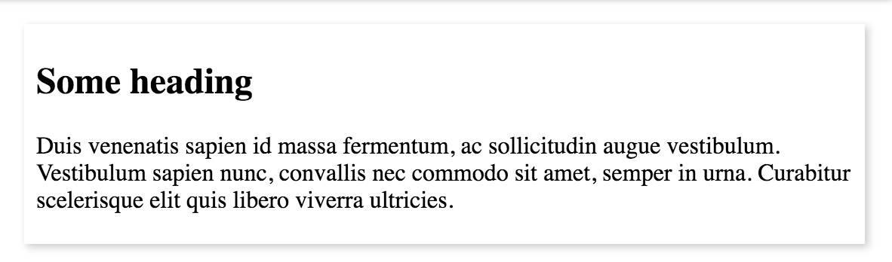

If you haven't seen this animation it's probably better to check it out first.

> Search "Thanos" on Google, and you'll see a golden hand, tap/click on it to see the magic.

## step - 1: create a basic DOM structure

- create some basic mark-up to show some items which we'll later make it disappear

```html
<div class="container">
  <div class="result">
    <div class="content">
      <h2>Some heading</h2>
      <p>
        Duis venenatis sapien id massa fermentum, ac sollicitudin augue
        vestibulum. Vestibulum sapien nunc, convallis nec commodo sit amet,
        semper in urna. Curabitur scelerisque elit quis libero viverra
        ultricies.
      </p>
    </div>
  </div>
</div>
```

- add some CSS to pretty things a bit 
- copy/paste the `div` with `class=result` a number of times (later)

## step - 2: nail the disappearing act

- if you notice closely the google animation on phone (desktop animation is different) looks of this nature
- the search result appears to be sliding left and right at the same time for some distance and then booom! it disappears
- we'll achieve this in these steps
  - getting hold of the actual DOM element
  - cloning it twice and sliding first clone left and the other to right and destroying them after the animation
  - making the main element hidden

```js
const searchElement = document.querySelector(".content")
const parent = searchElement.parentNode
const clone1 = searchElement.cloneNode(true)
const clone2 = searchElement.cloneNode(true)
```

- make the parent relative and attach the clones to the same parent
- also make the clones absolutely positioned with a negative z-index so that they stick under the original node perfectly
- to make the parent relative and above cloned elements absolute I've created some simple CSS classes which I'll add via JavaScript

```css
.relative {
  position: relative;
}

.absolute {
  position: absolute;
  top: 0;
  bottom: 0;
  left: 0;
  right: 0;
  opacity: 0.7;
  z-index: -1;
  will-change: transform;
  transition: transform 2s ease-out 0s, opacity 1.2s ease-out 0s;
}
```

> I've also added a `transition` property to class `absolute` so as to animate them using `transforms`

```js
parent.classList.add("relative")
clone1.classList.add("absolute")
clone2.classList.add("absolute")
// finally append to parent
parent.append(clone1, clone2)
```

- now that we're all set, let's set the animation rolling
- simple CSS classes for animation

```css
.fade {
  opacity: 0;
}
.slide-left {
  transform: translateX(-100px);
}
.slide-right {
  transform: translateX(100px);
}
```

- first, make the orginal element's opacity 0 - to get it out of the way
- then slide the clones

```js
searchElement.classList.add("fade")

// slide the clones in the next frame
setTimeout(() => {
  clone1.classList.add("slide-left", "fade")
  clone2.classList.add("slide-right", "fade")
}, 0)
```

- **it looks great!** but we have two useless cloned nodes lying around.
- what if they both get destroyed after they've served their purpose?
- **Enter** `transitionend` event!
- below is a small function that adds an event listener and removes the node

```js
const removeNode = node => {
  node.addEventListener("transitionend", () => {
    node.remove()
  })
}
```

- attaching this before adding the classes to animate them!

```js
removeNode(clone1)
removeNode(clone2)
```

> we're almost there!

## step - 3: doing this randomly for half the search result, because you know Thanos!

- let's create a button with text "SNAP" which should start rolling things
- we'd then somehow select the nodes that we want to animate using the code we created in `step-2`
- use HTML's `scrollIntoView` to smoothly get the element into view first
- then animate and make the node vanish

```js
const snapButton = document.querySelector(".big-button")
snapButton.addEventListener("click", () => {
  const allSearchElements = [...document.querySelectorAll(".content")]

  // randomize returns random results array with half the length of original one
  const half = randomize(allSearchElements)
  // start the chain reaction
  half.reduce(async (promise, curr) => {
    // waiting for one result to vanish!
    await promise
    return scrollTo(curr).then(() => vanish(curr))
  }, Promise.resolve())
})
```

- `vanish` contains the code we created in step 2.
- see the code at [Github](https://github.com/ankeetmaini/css-challenges/tree/master/src/thanos-snap)
- or this [codepen](https://codepen.io/ankeetmaini/pen/QRLXEK)

